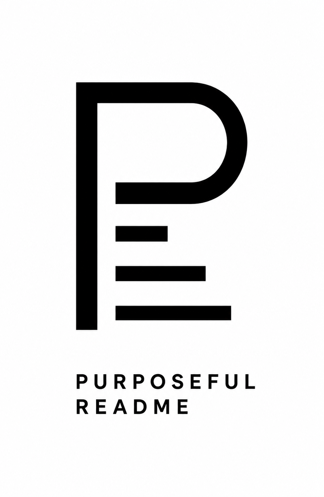

# Purposeful Readme

***A principled, purposeful standard for READMEs.***

***

**Purposeful Readme** is a specification and style guide for `README.md` files built on clarity, intent, and discipline. It treats the README as an authoritative entry point, rather than an encyclopedia. Grounded in real-world developer frustrations, it defines a human-legible, machine-parseable structure that bridges the gap between documentation and data — enabling faster project comprehension, reliable automation, and seamless integration with AI-native tooling.

It is intended to evolve through practical use and open community discussion.

`purposeful-readme` `license: CC BY 4.0` `version: 0.1.0`

***

## Table of Contents

1. [Introduction](#1-introduction)
    - 1.1 [What is a README?](#11-what-is-a-readme)
    - 1.2 [Guiding Principles](#12-guiding-principles)
    - 1.3 [Applicability](#13-applicability)
    - 1.4 [Relationship to Other Files](#14-relationship-to-other-files)
    - 1.5 [Normative Language](#15-normative-language)
    - 1.6 [Callout Conventions](#16-callout-conventions)
2. [Format](#2-format)
    - 2.1 [File Format](#21-file-format)
    - 2.2 [Machine Metadata Block](#22-machine-metadata-block)
    - 2.3 [Header Block](#23-header-block)
        - 2.3.1 [Title](#231-title)
        - 2.3.2 [Tagline](#232-tagline)
        - 2.3.3 [Short Description](#233-short-description)
        - 2.3.4 [Badges](#234-badges)
    - 2.4 [Table of Contents](#24-table-of-contents)
    - 2.5 [Sections](#25-sections)
        - 2.5.1 [Overview](#251-overview)
        - 2.5.2 [Navigation](#252-navigation)
        - 2.5.3 [Design Principles](#253-design-principles)
        - 2.5.4 [Requirements](#254-requirements)
        - 2.5.5 [Platform Notes](#255-platform-notes)
        - 2.5.6 [Installation](#256-installation)
        - 2.5.7 [Configuration](#257-configuration)
        - 2.5.8 [Usage](#258-usage)
        - 2.5.9 [Security](#259-security)
        - 2.5.10 [Roadmap](#2510-roadmap)
        - 2.5.11 [Troubleshooting](#2511-troubleshooting)
        - 2.5.12 [FAQ](#2512-faq)
        - 2.5.13 [Contributing](#2513-contributing)
        - 2.5.14 [Acknowledgements](#2514-acknowledgements)
        - 2.5.15 [License](#2515-license)
    - 2.6 [Section Scaffolding Reference](#26-section-scaffolding-reference)
    - 2.7 [Markdown Formatting](#27-markdown-formatting)
3. [Writing](#3-writing)
    - 3.1 [The Entry Point Principle](#31-the-entry-point-principle)
    - 3.2 [Link, Don't Narrate](#32-link-dont-narrate)
    - 3.3 [Time to First Success](#33-time-to-first-success)
    - 3.4 [Earn Every Badge](#34-earn-every-badge)
    - 3.5 [Preventing Staleness](#35-preventing-staleness)
    - 3.6 [Structured for Machines](#36-structured-for-machines)
4. [Antipatterns](#4-antipatterns)
    - 4.1 [The Billboard](#41-the-billboard)
    - 4.2 [The Stub](#42-the-stub)
    - 4.3 [The Blog Post](#43-the-blog-post)
    - 4.4 [The Stale Section](#44-the-stale-section)
    - 4.5 [Changelog in README](#45-changelog-in-readme)
5. [Integration](#5-integration)
    - 5.1 [Validation and CI](#51-validation-and-ci)
    - 5.2 [Agentic AI Workflows](#52-agentic-ai-workflows)
6. [FAQ](#6-faq)
7. [Acknowledgements](#7-acknowledgements)
8. [License](#8-license)

***

## 1. Introduction

### 1.1 What is a README?

A README is the single file a reader sees first when encountering a project. Its purpose is to answer — quickly and clearly — the questions every reader arrives with: *What is this? Can I use it? How do I start? What should I be careful of?*

It is not a tutorial, a blog post, an API reference, or a changelog. Those exist elsewhere and must remain elsewhere.

It is imperative to remember that the consumers of a README are ultimately unforgiving decision-makers (whether human or machine) making rapid judgement calls: whether to adopt a library, how to get started, whether to trust the project. A README that fails to serve them quickly fails entirely — because unlike a search result, a README does not get a second chance.

***

### 1.2 Guiding Principles

- **READMEs are for readers.** Their structure, language, and length serve to inform the reader, quickly and efficiently.
- **The README is an entry point, *not* a destination.** Essentially a map, it orients, summarizes, and links each topic to its canonical source.
- **Human readability and machine readability are complementary goals.** Stable section names, predictable ordering, working links, and tagged code blocks make the documentation easier to read, lint, and parse; clarity benefits everyone.
- **Answer questions in the order a stranger asks them.** Section ordering is functional, *not* decorative.
- **Every section must earn its place.** If a section is likely to go stale, duplicate another document, or fail to help the reader act, it has *no* place in a README.

***

### 1.3 Applicability

**Purposeful Readme** is designed for repository-centred projects in which the README serves as the primary point of first contact. It is especially well suited to projects that use version control and maintain companion `.md` documentation as complexity grows — such as `SECURITY.md`, `CONTRIBUTING.md`, `INSTALL.md`, `CHANGELOG.md`, `ARCHITECTURE.md`, and others. **Purposeful Readme** does not require every companion file to exist from day one. Projects may choose to adopt them incrementally as their documentation needs mature.

In monorepos or multi-package repositories, each `README.md` file — whether at the repository root or within a subdirectory — is independently subject to this specification.

***

### 1.4 Relationship to Other Files

A README rarely stands alone. Most projects already rely on a number of companion documents — *and those that don't, probably should* — each serving a distinct purpose and audience.

**Purposeful Readme** does not invent this broader documentation landscape. Rather, it approaches this typically disjointed environment as a cohesive documentation ecosystem and positions the README as the entry point through which readers navigate it meaningfully.

For readers, this makes it easier to find the right depth of information at the right moment. For maintainers, it reduces duplication, clarifies where each kind of information belongs, and makes documentation easier to keep current.

The following is but a representative sample of what a project's documentation ecosystem may encompass:

| File | Audience | Purpose |
| :-- | :-- | :-- |
| **`README.md`** | **All readers first encountering the project** | **Entry point and navigation map** |
| `CHANGELOG.md` | Users and contributors tracking changes | Curated release history |
| `CONTRIBUTING.md` | Potential contributors | How to contribute |
| `SECURITY.md` | Security researchers and cautious adopters | Vulnerability scope and disclosure |
| `INSTALL.md` | Users with complex installation needs | Full installation reference |
| `ARCHITECTURE.md` | Contributors and technical evaluators | System design, structure, and key decisions |
| `AGENTS.md` | AI coding agents and agentic workflows | Operational instructions for automated tooling |
| *`... .md`* | *...* | *...* |

> ℹ️ `AGENTS.md` is an emerging convention for providing AI coding agents with operational context such as build commands, test conventions, code style rules, and architectural constraints. **Purposeful Readme** does not fold that material into the README itself. Where `AGENTS.md` exists, the README should point to it while remaining the primary project entry point for readers.

***

### 1.5 Normative Language

The key words "MUST", "MUST NOT", "REQUIRED", "SHALL", "SHALL NOT", "SHOULD", "SHOULD NOT", "RECOMMENDED", "MAY", and "OPTIONAL" in this document are to be interpreted as described in [RFC 2119](https://www.ietf.org/rfc/rfc2119.txt).

In brief: [must] and [required] denote an absolute requirement; [must not] denotes an absolute prohibition; [should] and [recommended] denote that valid reasons may exist to deviate, but the full implications must be understood before doing so; [may] and [optional] denote that an item is genuinely discretionary.

A validator encountering a violation of a [must] or [must not] rule must emit a failure; all other violations may instead emit a warning.

***

### 1.6 Callout Conventions

Throughout this specification, styled callout blocks are used to supply supplemental guidance without interrupting the normative flow of the text. Each callout type carries a distinct and consistent meaning, summarised below.

| Callout | Meaning | Tone |
| :-- | :-- | :-- |
| 💡 | Helpful insight, rationale, or good-to-know guidance | Advisory |
| ✋ | Caution, misuse risk, *"do not gloss over this"* | Warning |
| ℹ️ | Neutral clarification, definition, or contextual background | Informational |
| ⚠️ | Strong warning: safety, security, correctness, or staleness risk | Serious |
| 🧭 | Navigational redirect; points content to its proper place | Structural |
| 📝 | A guiding precept distilled as aphorism | Philosophical |

All callouts are informative. A callout cannot itself establish a normative obligation; that function belongs exclusively to the normative language defined in [§1.5](#15-normative-language).

***

## 2. Format

### 2.1 File Format

The filename must be `README.md`.

The file content must be Markdown and encoded in UTF-8.

The file must begin with the [Machine Metadata Block](#22-machine-metadata-block), followed thereafter by the [Header Block](#23-header-block), then the [Table of Contents](#24-table-of-contents) (conditionally required), and then finally the various relevant [Sections](#25-sections).

*No* other top-level structure is permitted.

Sections must appear in the order defined in [§2.5](#25-sections) (*see [§2.6](#26-section-scaffolding-reference) for a quick summary*). Conditionally required, recommended, or optional sections may be omitted, but the relative order of the remaining sections *must not* change.

> 💡 If a repository provides translated READMEs, each translation should use a language-qualified filename such as `README.de.md` or `README.fr.md`, using an appropriate BCP 47 / RFC 5646 language tag. In multilingual repositories, `README.md` should be reserved for the default primary language of the repository. For a repository that provides only one README in a non-English language, `README.md` may remain unqualified.

***

### 2.2 Machine Metadata Block

The machine-readable metadata block must be the first content in the file. It must appear at the very top of the file, before the [Header Block](#23-header-block), in the form of a HTML comment.

*No* whitespace, prose, badge, or heading may appear before it.

The metadata block is — by design — invisible when visually rendered, allowing tools, validators, and agentic systems to parse it without affecting human-readable content.

The block must match the following normative template. This template defines the required field names, order, and syntax. `resource` and `spec` are literal values in this specification; the remaining values must be replaced with valid project-specific inputs.

```markdown
<!--
resource: readme
spec: purposeful-readme/0.1.0
version: <VERSION | null>
type: <TYPE>
language: <LANGUAGE>
status: <STATUS>
visibility: <VISIBILITY>
docs: <DOCS | null>
-->
```

The structure of the block is formally defined by the following grammar, expressed in ABNF ([RFC 5234](https://www.rfc-editor.org/rfc/rfc5234)):

```abnf
metadata-block  = open-delimiter *WSP LF
                  field-line               ; resource
                  field-line               ; spec
                  field-line               ; version
                  field-line               ; type
                  field-line               ; language
                  field-line               ; status
                  field-line               ; visibility
                  field-line               ; docs
                                           ; strict concatenation: no bare LF between fields
                  close-delimiter

open-delimiter  = "<!--"
close-delimiter = "-->"
field-line      = field-name ": " field-value LF
field-name      = 1*LOWER         ; lowercase ASCII letters only
field-value     = url-value / token-value / "null"
url-value       = DQUOTE url DQUOTE / url
url             = abs-url / rel-path
abs-url         = "http" ["s"] "://" 1*(%x21-7E)  ; absolute http/https URL
rel-path        = 1*(%x21-7E)                     ; relative path (e.g., ./docs/index.html)
token-value     = 1*(%x21-7E)     ; any printable non-whitespace ASCII
LOWER           = %x61-7A         ; a–z
```

The block must use a multi-line format: the opening `<!--` and closing `-->` must each occupy their own line, with valid fields on the lines between them. Blank lines are *not* permitted inside the block; every line between `<!--` and `-->` must contain exactly one field.

Field names are case-sensitive and must be lowercase. They must appear in the order shown above.

The following fields are defined:

| Field | Condition | Input |
| :-- | :-- | :-- |
| **`resource`** | Required | The kind of documentation the file represents; must be set as `readme` |
| **`spec`** | Required | The specification identifier and version in the form `purposeful-readme/<version>` (*current version:* `0.1.0`) |
| **`version`** | Required | The version of the project this README describes (e.g., `1.0.0`; [SemVer](https://semver.org) recommended), or `null` for projects without a versioned release cadence |
| **`type`** | Required | One of: `library`, `application`, `service`, `infrastructure`, `data`, `documentation`, `template`, `extension`, `multi` |
| **`language`** | Required | Primary implementation language in lowercase (e.g., `rust`, `python`, `go`, `html`, `markdown`) |
| **`status`** | Required | One of: `planned`, `experimental`, `beta`, `active`, `maintenance`, `deprecated`, `archived` |
| **`visibility`** | Required | One of: `public`, `internal`, `private` |
| **`docs`** | Required | Canonical documentation URL or relative path, or `null` if none exists |

> ⚠️ **Important to note:**
>
>> - `spec` must use a forward slash (`/`) as the separator, *not* `:`, `@`, `-` or anything else.
>> - For polyglot projects, set `language` to whichever that is dominant either by volume or by primary intent — the choice is left to the maintainer.
>> - For the `docs` field: a bare URL or relative path (no whitespace) may be written without delimiters. A value containing spaces — as may occur with certain file paths — must be enclosed in double-quote characters (`"`); the double-quote delimiter is otherwise optional.

**`type` options meaning *(categories may overlap; choose the closest primary fit)*:**

- `library`: reusable code intended to be consumed by other software (APIs, packages, modules).
- `application`: end-user software meant to be directly used by humans (web apps, desktop apps, mobile apps, CLIs).
- `service`: software designed to run continuously and be consumed by other systems over a network (APIs, backends, daemons).
- `infrastructure`: code or configuration that defines, provisions, or manages environments and systems (IaC, deployment, CI/CD).
- `data`: non-code artifacts such as datasets, schemas, or machine learning models.
- `documentation`: a repository whose primary material is prose or reference material (guides, specifications, knowledge bases).
- `template`: starter projects, boilerplates, or scaffolding intended to be copied and adapted.
- `extension`: add-ons that extend or integrate with another system (plugins, connectors, adapters).
- `multi`: a repository that meaningfully spans multiple of the above types — typically a monorepo or a project that is both a library and an application, a service and infrastructure, etc. Use only when no single type is the clear primary fit; where possible, prefer the most specific applicable value.

**`status` options meaning *(values represent a progression; choose the closest current fit)*:**

1. `planned`: an idea, placeholder, or scaffold exists, but no meaningful implementation yet.
2. `experimental`: unstable, exploratory, or early-stage work.
3. `beta`: mostly feature-complete, but still under active testing and/or refinement.
4. `active`: stable enough for use, with ongoing feature development.
5. `maintenance`: no major new features planned; only fixes and minor updates continue.
6. `deprecated`: may still be usable, but discouraged; a replacement or migration path is preferred.
7. `archived`: intentionally read-only; no further changes will be made.

**`visibility` options meaning *(audiences may overlap; choose the closest fit)*:**

- `public`: intended for unrestricted external consumption.
- `internal`: intended for a restricted audience (organisation, team, or selected individuals); not for general public consumption.
- `private`: intended solely for the author or owner; not shared beyond the immediate owner(s).

A metadata block that omits a required field, changes a field name, changes the field order, or violates the syntax above is non-conformant.

> ✋ **Version compatibility:** The `spec` field declares the version of **Purposeful Readme** the README was authored against. Validators should, by default, accept any declared version of the specification unless explicitly configured to enforce a minimum or exact version. To avoid feature incompatibility issues, maintainers should update the `spec` field when adopting a newer version of the specification.

> 💡 This block is the only required machine-oriented structure that is not directly visible in rendered Markdown. All other machine readability should arise from the same disciplined structure that benefits human readers.
>
> ***Note:*** The `resource` and `spec` fields have been designed for extensibility with a broader metadata-led documentation ecosystem — *now under conceptual development*.

***

### 2.3 Header Block

The Header Block is the mandatory opening of every README. It consists, in order, of:

1. [Title](#231-title)
2. [Tagline](#232-tagline) (optional), followed by a `***` horizontal rule if present
3. [Short Description](#233-short-description)
4. [Badges](#234-badges) (optional)

Tagline, Short Description, and Badges *must not* use Markdown headings.

#### 2.3.1 Title

**Title** must be a first-level Markdown heading (`#`) containing only the project name.

It must exactly match the primary project name used by the package manifest, repository, or published artifact, unless a deliberate naming distinction is documented elsewhere in the repository.

> ℹ️ Within repositories, this is usually authoritatively found in places such as `Cargo.toml`, `package.json`, `pyproject.toml`, `go.mod`, etc.

It *must not* include a version number, tagline, emoji, or any decorative prefix/suffix.

***Example:***

```markdown
# The Project Name
```

#### 2.3.2 Tagline

**Tagline** is optional.

A tagline is a brief (~ 80 characters), evocative phrase — aspirational or characterful — that represents the spirit or identity of the project.

If present, it must appear on its own line immediately after the [Title](#231-title) and before a `***` horizontal rule that separates it from the [Short Description](#233-short-description). It must be wrapped in Markdown emphasis — italics, bold, or both.

It is *not* a substitute for the Short Description and *must not* attempt to serve its informational function.

***Examples:***

**Italicised:**

```markdown
*Do one thing, and do it well.*
```

**Italicised & Bolded:**

```markdown
***Do one thing, and do it well.***
```

#### 2.3.3 Short Description

**Short Description** must be a single sentence, on its own line, immediately following the [Title](#231-title) (or [Tagline](#232-tagline), if present). It *must not* use Markdown emphasis.

It must be concise (~ 150 characters), concrete, and self-sufficient. It must state *what the project is*, *what it does*, and *the primary utility or outcome it enables*.

It *must not* rely on surrounding prose to become meaningful.

Where a project has a package manifest or repository description field, it should match that field exactly so that one canonical sentence serves repository hosting, package registries, search indexing, dependency tooling, and agentic workflows alike.

***Example:***

```markdown
A zero-dependency Rust crate for constructing Merkle trees with pluggable hash backends, enabling
flexible cryptographic proof generation.
```

***Anti-pattern:***

```markdown
A powerful, flexible, and extensible framework.
```

Notice how the anti-pattern example simultaneously describes both almost everything and almost nothing. State what the project does, *not* how highly the author thinks of it.

> 💡 This line is the most-read, most-indexed, and most-scraped part of any README. It will appear in package registry listings, dependency update PRs, and AI agent context windows. Treat it accordingly.

#### 2.3.4 Badges

**Badges** are optional.

If present, they must appear immediately after the [Short Description](#233-short-description) as a distinct line cluster with *no* heading. Badges must communicate a verifiable, actionable state.

Permitted badge categories (non-exhaustive):

- Build or CI status
- Latest release version
- License identifier
- Test coverage (only if kept current by automation)

Decorative badges, social counters, technology vanity badges, and similar non-actionable badges *must not* be used.

When in doubt, cut the badge. A README with three meaningful badges is better than one with twelve.

***Example:***

```markdown


```

***

### 2.4 Table of Contents

**Condition:**

| Requirement   | Criteria                                                                           |
|---------------|------------------------------------------------------------------------------------|
| Required      | if the README > 100 lines or contains ≥ 6 second-level sections *(excluding self)* |
| Recommended   | otherwise                                                                          |

**Table of Contents** must use the exact second-level Markdown heading `## Table of Contents`. It must appear after the [Header Block](#23-header-block) and before the first substantive section.

It should link to every second-level section present in the README. Though rarely applicable, it may also include selected deeper headings where doing so materially improves navigation, but should nevertheless remain concise.

Where practical, it should be generated or maintained automatically. A hand-maintained Table of Contents introduces staleness risk and should be avoided unless the project is willing to manually update it whenever headings change.

If the README is short enough that a Table of Contents adds noise rather than clarity, it may be omitted.

***Example:***

```markdown
## Table of Contents

- [Overview](#overview)
- [Requirements](#requirements)
- [Installation](#installation)
- [Usage](#usage)
- [Security](#security)
...
- [License](#license)
```

***

### 2.5 Sections

All sections must use second-level Markdown headings (`##`).

Section heading names must match those defined below exactly, preserving spelling, capitalization, and order of occurrence. This is intentional: strict consistency renders the README easier for people to read and easier for tools to validate, index, and interpret.

> ⚠️ ***Important to note:*** For both English and non-English language READMEs, the section headings must themselves be strictly in English. This is so that validators, indexers, and automated tools can reliably parse section boundaries without language-specific logic or ambiguity.

#### 2.5.1 Overview

**Condition:**

| Requirement   | Criteria |
|---------------|----------|
| Required      | always   |

**Overview** must expand the [Short Description](#233-short-description) in 2–5 sentences. It must explain *the problem the project addresses*, *the approach it takes at a high level*, and — just as critically — *any important non-goals or scope boundaries*.

It *must not* repeat the Short Description, either verbatim or paraphrased. The Short Description identifies the project in one sentence; this establishes scope, boundaries, and context.

***Example:***

```markdown
## Overview

`the-project-name` constructs Merkle trees for cryptographic audit logs and zero-knowledge
proof-oriented pipelines. It supports SHA-256, BLAKE3, and custom hash functions via a trait-based
interface. It does not implement any proof protocol, persistence layer, or networking stack.
```

> 💡 Defining scope boundaries helps guard against misuse, wrong-audience adoption, and duplicate Issues asking for out-of-scope features. It is underused in practice, yet high-value in consequence.

#### 2.5.2 Navigation

**Condition:**

| Requirement   | Criteria                                                                                             |
|---------------|------------------------------------------------------------------------------------------------------|
| Required      | if the README is the root of a multi-component repository, or a non-root README in such a repository |
| Omit          | otherwise                                                                                            |

**Navigation** must provide a travelable, one-level view of the immediate context in which this README sits. It serves two roles, each dependent on where in the repository the README is located:

- **Root README**: a table of the immediate child components — packages, modules, sub-projects, or other named subdivisions — each with a relative link to its own `README.md`.
- **Non-root README**: a named link to the immediate parent README, followed by a table of any immediate child components (if present).

Deeper branching, in either direction, should not be shown; readers navigate level by level.

A brief one-line description alongside each child entry is recommended where it materially aids navigation.

This section must *not* expand into architecture overviews, dependency graphs, or cross-cutting summaries; those belong in `ARCHITECTURE.md`, its equivalent, or otherwise appropriate documentation where they should be contained.

Each component `README.md` must be fully self-sufficient and independently conformant with this specification. It must *not* assume the reader has already read the parent README.

***Examples:***

**Root README:**

```markdown
## Navigation

| Component | Description |
| :-- | :-- |
| [`core`](core/README.md) | Core hashing and tree construction library |
| [`cli`](cli/README.md) | Command-line interface for tree generation and proof verification |
| [`wasm`](wasm/README.md) | WebAssembly build target |
```

**Non-root README:**

```markdown
## Navigation

↑ [`core`](../README.md)

| Component | Description |
| :-- | :-- |
| [`parser`](parser/README.md) | Expression parser and token stream |
| [`evaluator`](evaluator/README.md) | Tree-walking evaluator |
```

**Non-root README with no children:**

```markdown
## Navigation

↑ [`cli`](../README.md)
```

#### 2.5.3 Design Principles

**Condition:**

| Requirement   | Criteria                                                                                         |
|---------------|--------------------------------------------------------------------------------------------------|
| Required      | if **`type`** ∈ {`library`, `application`, `service`, `infrastructure`, `template`, `extension`} |
| Recommended   | otherwise                                                                                        |

**Design Principles** must be expressed as a bulleted list of 3–7 durable — i.e., permanent enough to remain true across multiple releases — decisions, constraints, or values that shape the project. Each principle must be concise, stable, and objective/testable in spirit.

These are *not* features. A principle governs *how* the project is built; a feature describes *what* it does.

Explanations *should not* be inlined. If elaboration is necessary, the README should link to `ARCHITECTURE.md`, its equivalent, or otherwise appropriate documentation where it should be contained.

***Example:***

```markdown
## Design Principles

- Compile-time verification is strictly preferred over runtime checks. [ADR-001]
- The public API must remain entirely independent of third-party crate types. [ADR-002]
- Memory allocations are strictly opt-in and visible via feature flags. [ADR-003]
- The core hashing logic must remain deterministic and free of concurrency primitives. [ADR-004]
- All internal state transitions must be representable as a finite state machine. [ADR-005]
- Maintain zero internal global state. [ADR-006]
```

> 💡 This section is the highest-value section for contributors, reviewers, and AI agents that need to understand constraints before proposing or generating changes. It answers "*why does the code look like this?*" before the question is even asked.

#### 2.5.4 Requirements

**Condition:**

| Requirement   | Criteria                            |
|---------------|-------------------------------------|
| Required      | if installable or buildable project |
| Omit          | otherwise                           |

**Requirements** must be a minimal list of what a user needs before installation or use. This may include:

- Restricted operating system
- Runtime or toolchain versions (e.g., `Rust ≥ 1.80`, `Python ≥ 3.11`)
- Non-obvious system-level dependencies (e.g., `libssl-dev`, a running PostgreSQL instance)

It *must not* list transitive library dependencies — that is the package manager's job.

If requirements are extensive, platform-divergent, or operationally complex, the README should provide only a summary here and link to `INSTALL.md`, its equivalent, or otherwise appropriate documentation where it should be contained.

***Example:***

```markdown
## Requirements

- Rust ≥ 1.80
- OpenSSL development headers (`libssl-dev` on Debian/Ubuntu, `openssl-devel` on Fedora)
- A POSIX-compatible shell for the source installation path
```

#### 2.5.5 Platform Notes

**Condition:**

| Requirement   | Criteria                                         |
|---------------|--------------------------------------------------|
| Required      | if behaviour materially differs across platforms |
| Omit          | otherwise                                        |

**Platform Notes** must be a tight list or table covering platform-specific differences. Material differences include: missing features on one platform, different installation paths, known runtime differences.

"*Tested on Linux*" is *not* a platform note.

If platform-specific guidance is necessary, the README should link to `USAGE.md`, its equivalent, or otherwise appropriate documentation where it should be contained.

***Example:***

```markdown
## Platform Notes

- Windows: supported with the MSVC toolchain; MinGW is not tested.
- Linux: fully supported.
- macOS: supported, but file watcher behaviour may differ under sandboxed environments.
```

#### 2.5.6 Installation

**Condition:**

| Requirement   | Criteria               |
|---------------|------------------------|
| Required      | if installable project |
| Omit          | otherwise              |

**Installation** must show the shortest canonical path to a working installation. For most projects, this should be a single fenced code block.

Commands should be self-explanatory. Where necessary, explanatory prose between commands should be minimal.

If multiple install paths exist (e.g., multiple package managers), each may be shown in a separate labeled block. If installation is complex, the README should show only the canonical path here and link to `INSTALL.md`, its equivalent, or otherwise appropriate documentation for all other methods.

***Examples:***

````markdown
## Installation

**Cargo**
```toml
[dependencies]
the-project-name = "1.0"
```
````

````markdown
## Installation

**From source**
```sh
git clone https://github.com/owner/the-project-name
cd the-project-name
cargo build --release
```
````

#### 2.5.7 Configuration

**Condition:**

| Requirement   | Criteria                                                         |
|---------------|------------------------------------------------------------------|
| Required      | if explicit configuration is required to begin using the project |
| Omit          | otherwise                                                        |

**Configuration** must remain minimal. It should present only the smallest set of configuration inputs a user requires to get started, such as essential environment variables, configuration keys, endpoints, or the names of required secrets. Actual secret values must *never* be included.

This section *must not* become a full configuration reference. Exhaustive configuration reference material must be delegated to `CONFIG.md`, its equivalent, or otherwise appropriate documentation where it should be contained.

***Example:***

````markdown
## Configuration

Set the following environment variables before starting the service:

```env
DATABASE_URL=postgres://localhost:5432/the_project
API_TOKEN=replace-me
LOG_LEVEL=info
```

See [`CONFIG.md`](docs/CONFIG.md) for the full configuration reference.
````

#### 2.5.8 Usage

**Condition:**

| Requirement   | Criteria |
|---------------|----------|
| Required      | always   |

**Usage** must answer the question: *how does a user accomplish the primary task this project exists to perform?*

It must include 1–3 representative examples showing the most common real-world use cases. Each example must be self-contained: a reader should be able to understand *what the example does*, *why they would use it*, and *what outcome it produces* without relying on unstated setup, prior domain knowledge, or explanation from other sections.

Any explanatory prose should be brief and only include the minimum context needed to make the example immediately understandable.

A `### Quick Start` sub-section may optionally be placed at the beginning of the section to surface the shortest viable path to a working outcome — a single code block or a minimal invocation that gets a new user running immediately. If used, it must be strictly minimal; anything beyond the single most direct path belongs elsewhere.

Edge cases, exhaustive coverage, and full API reference material should be delegated to a linked `USAGE.md`, its equivalent, or otherwise appropriate documentation where they should be contained.

***Example:***

````markdown
## Usage

### Quick Start

```sh
the-project-name --input data.csv --output result.json
```

### Examples

Create a Merkle tree from a small set of records, generate an inclusion proof for one record, and
verify that the record belongs to the tree:

```rust
use the_project_name::{MerkleTree, Sha256};

let records = vec![b"block-a", b"block-b", b"block-c"];
let tree = MerkleTree::<Sha256>::from_leaves(&records);

let target = b"block-b";
let target_index = 1;

let proof = tree.proof(target_index).expect("record exists in the tree");
assert!(tree.verify(&proof, target));
```

This shows the basic workflow: build a tree, create a proof for a chosen leaf, and verify that
proof against the original value.

See [`USAGE.md`](docs/USAGE.md) for advanced options, edge cases, and complete API details.
````

#### 2.5.9 Security

**Condition:**

| Requirement   | Criteria |
|---------------|----------|
| Recommended   | always   |

**Security** must define the practical security posture of the project in concise form (2-4 sentences). Where relevant, it should address:

1. **Scope & Non-Goals**: what the project protects against — and what it explicitly does not.
2. **Trust Assumptions**: what inputs, environments, or operators are assumed to be trusted.
3. **Misuse & Foot-Guns**: any known/anticipated unsafe usage patterns or configurations to avoid.
4. **Reporting**: where to find the project's vulnerability reporting or security policy information.

For projects that process untrusted input, manage secrets, operate on networks, or run with elevated privileges, this section is especially important and should be treated as effectively expected.

For low-risk projects (e.g., documentation-only or static asset repositories), a brief declarative statement is sufficient, for example: “This project contains no executable code, handles no sensitive data, and has no network dependencies.”

If further security detail is necessary, the README should provide only a summary here and link to `SECURITY.md`, its equivalent, or otherwise appropriate documentation where it should be contained.

***Example:***

```markdown
## Security

`the-project-name` provides data integrity guarantees only. It does not authenticate the origin of
input data, prevent malicious input selection, or replace a signature scheme. Do not use it as an
authenticity or authorization mechanism.

For vulnerability reporting and further security guidance, see [`SECURITY.md`](SECURITY.md).
```

> 💡 Security is not a niche concern. Even a short, explicit statement helps prevent incorrect assumptions and reduces downstream risk.

#### 2.5.10 Roadmap

**Condition:**

| Requirement   | Criteria |
|---------------|----------|
| Recommended   | always   |

**Roadmap** must be a short checklist (≤ 5 items) of confirmed near-term work, followed by a link to the canonical planning surface such as issues, milestones, or a project board. If the roadmap is fully maintained elsewhere, this section should contain only that link.

All items must use an unchecked box (`[ ]`). An item tagged `***[IN PROGRESS]***` at the end of the line indicates work actively underway. An untagged item indicates planned work not yet started. Completed work must be removed from the list entirely.

Do *not* include items without a committed intention to implement them. Do *not* include timeline estimates; you may, however, choose to order them chronologically. Do *not* use this section as a wishlist.

If this section cannot be kept current, it should be omitted. A stale roadmap is worse than no roadmap — it signals an unmaintained project and creates confusion about what is and is not planned.

***Example:***

```markdown
## Roadmap

- [ ] Add BLAKE2b backend ***[IN PROGRESS]***
- [ ] Publish WebAssembly build target

See [open issues](https://github.com/owner/the-project-name/issues) for the full backlog.
```

#### 2.5.11 Troubleshooting

**Condition:**

| Requirement   | Criteria                                                                   |
|---------------|----------------------------------------------------------------------------|
| Recommended   | if **`type`** ∈ {`library`, `application`, `service`, `infrastructure`}    |
| Omit          | otherwise                                                                  |

**Troubleshooting** must contain 2–5 concrete Q&A pairs, in a tight question-and-answer format, covering the most common setup or runtime failures.

Entries must be actionable. They should describe the error or symptom, the likely cause, and the corrective action.

> 🧭 Content that would be better expressed as general usage clarification must belong in [FAQ](#2512-faq) instead.

Anything beyond five items should be delegated to `TROUBLESHOOTING.md`, its equivalent, or otherwise appropriate documentation where it should be contained.

***Example:***

```markdown
## Troubleshooting

**`error: failed to run custom build command for openssl-sys`**
This usually points to missing required packages. Install OpenSSL development headers:
`apt install libssl-dev` (Debian/Ubuntu) or `dnf install openssl-devel` (Fedora).

**Application exits with code 137 in CI**
This usually indicates an out-of-memory kill. Increase available memory or reduce parallelism
(e.g., `-j 2`).
```

#### 2.5.12 FAQ

**Condition:**

| Requirement   | Criteria |
|---------------|----------|
| Recommended   | always   |

**FAQ** must contain 2–5 concrete Q\&A pairs, in a tight question-and-answer format, covering recurring non-error questions about usage, behaviour, or design decisions.

Entries should clarify intent, expectations, or trade-offs — *not* address or repeat troubleshooting items.

> 🧭 As a rule of thumb, if it sounds like it could belong in [Troubleshooting](#2511-troubleshooting), it does.

Anything beyond five items should be delegated to `FAQ.md`, its equivalent, or otherwise appropriate documentation where it should be contained.

***Example:***

```markdown
## FAQ

**Q: Why does the tree root change between builds with identical inputs?**
A: Leaves must be sorted before constructing the tree. Use `MerkleTree::from_sorted_leaves` for
deterministic output.

**Q: Does this library support streaming large datasets?**
A: Not currently. The full dataset must fit in memory. Streaming support is planned but not yet
implemented.
```

#### 2.5.13 Contributing

**Condition:**

| Requirement   | Criteria                                  |
|---------------|-------------------------------------------|
| Required      | if project accepts external contributions |
| Omit          | otherwise                                 |

**Contributing** must be 2–4 sentences briefly describing the *scope* and *process* of contributions and pointing to the primary contribution path.

Do *not* inline contribution instructions here. Contribution workflow, coding conventions, review process, and sign-off requirements must be delegated to `CONTRIBUTING.md`, its equivalent, or otherwise appropriate documentation where it should be contained.

Code of conduct material (i.e., `CODE_OF_CONDUCT.md`), where present, should be linked from within `CONTRIBUTING.md` rather than directly from the README itself.

***Example:***

```markdown
## Contributing

All contributions are welcome. Please open an issue before beginning significant work so scope and
approach can be discussed.

See the contribution guidelines in [`CONTRIBUTING.md`](CONTRIBUTING.md).
```

> 💡 If the project maintains `AGENTS.md`, this section should link to it as the canonical operational guidance for coding agents and automated contribution workflows.

#### 2.5.14 Acknowledgements

**Condition:**

| Requirement   | Criteria  |
|---------------|-----------|
| Optional      | always    |

**Acknowledgements** must be a short list (≤ 6 items), used to cite prior art, inspirations, standards, specifications, articles, codebases, datasets, or other material resources that meaningfully shaped the project. It must remain narrowly scoped.

Where possible, listed items should link to their respective canonical sources for ease of navigation.

This section *must not* be used for contributor rosters, sponsor promotion, fundraising, general thank-you content, or formal legal attribution. Those belong elsewhere.

If acknowledgements become extensive or require elaboration, the README should provide only a summary here and link to `ACKNOWLEDGEMENTS.md`, its equivalent, or otherwise appropriate documentation where it should be contained.

***Example:***

```markdown
## Acknowledgements

This project was informed by [Project X](https://the-project-x-link.com),
[Project Y](https://the-project-y-link.com), the [Initiative Z](https://initiative-z-link.com)
discussion, and other innovative conversations around hashing.

Additional references are listed in [`ACKNOWLEDGEMENTS.md`](ACKNOWLEDGEMENTS.md).
```

#### 2.5.15 License

**Condition:**

| Requirement   | Criteria |
|---------------|----------|
| Required      | always   |

**License** must be the last section.

It must provide a concise (1-2 lines) snapshot of the project's licensing. It must state the [SPDX license identifier](https://spdx.org/licenses/) and the copyright holder. The referenced SPDX license identifier must link to `LICENSE`, its equivalent, or otherwise the project's canonical licensing documentation.

If the project uses multiple licenses, the README should list only the primary identifiers in brief. Any detailed breakdown of which licenses apply to which files, directories, components, or distribution paths should be contained in the canonical licensing documentation rather than expanded in the README.

***Examples:***

**Single License:**

```markdown
## License

[MIT](LICENSE) © {Year} Your Name/Organization.
```

**Multiple Licenses:**

```markdown
## License

[GPL-3.0-or-later](./project_library/LICENSE) and [Apache-2.0](./project_gui/LICENSE) © {Year} Your
Name/Organization.

See [LICENSE](LICENSE) for more details.
```

***

### 2.6 Section Scaffolding Reference

| Position | Section | Condition | Notes |
| :-- | :-- | :-- | :-- |
| 1 | [Overview](#251-overview) | Required | - |
| 2 | [Navigation](#252-navigation) | Required (contingent) / Omit | Required for monorepo or multi-component projects |
| 3 | [Design Principles](#253-design-principles) | Required (contingent) / Omit | Required for select project **`type`s** |
| 4 | [Requirements](#254-requirements) | Required (contingent) / Omit | Required for installable/buildable projects |
| 5 | [Platform Notes](#255-platform-notes) | Required (contingent) / Omit | Include only when platform differences materially affect use |
| 6 | [Installation](#256-installation) | Required (contingent) / Omit | Required for installable projects |
| 7 | [Configuration](#257-configuration) | Required (contingent) / Omit | Include only when explicit configuration is necessary for basic use |
| 8 | [Usage](#258-usage) | Required | - |
| 9 | [Security](#259-security) | Recommended | *Highly recommended* |
| 10 | [Roadmap](#2510-roadmap) | Recommended | Omit if it cannot be kept current |
| 11 | [Troubleshooting](#2511-troubleshooting) | Recommended (contingent) / Omit | Recommended for select project **`type`s** |
| 12 | [FAQ](#2512-faq) | Recommended | Must not duplicate Troubleshooting |
| 13 | [Contributing](#2513-contributing) | Required (contingent) / Omit | Required for projects accepting external contributions |
| 14 | [Acknowledgements](#2514-acknowledgements) | Optional | - |
| 15 | [License](#2515-license) | Required | *Must be last section* |

***

### 2.7 Markdown Formatting

**Purposeful Readme** has few opinions about Markdown style itself. It does not prescribe indentation style, reference-style links versus inline links, or ATX versus Setext heading style for the top-level title.

It does, however, impose the following requirements:

- Every fenced code block must include a language tag (e.g., ` ```rust `,` ```sh `, ` ```toml `, etc.)
- All links must resolve at render time. Relative links are preferred for files within the same repository.
- Code examples should be valid, current, and checked with the same quality standards used for the rest of the project where practical.
- Section headings must match the defined names in [§2.5](#25-sections) exactly and be in the order specified.
- Headings below the second level (`###` and deeper) are permitted within sections where they genuinely aid navigation, but should be used sparingly; most sections will not require them.

Readable Markdown is part of readable software documentation. The goal is *not* decorative uniformity, but consistent, dependable structure.

***

## 3. Writing

Structure defines the shape of a README. The following precepts govern what goes *inside* it — and what should *never* enter it at all.

### 3.1 The Entry Point Principle

A README is a map, not a territory.

Its job is to orient the reader and direct them toward the next correct source of detail — *not* to contain everything they might ever need. It *must not* attempt to be a tutorial, full API reference, changelog, architecture essay, or complete operational manual.

Every sentence in a README should justify its presence by helping a reader answer one of the immediate questions of first contact: *what is this project*, *can I use it*, *how do I start*, *what are the boundaries*, and *where do I go next to learn more?*

> 📝 ***❝A README that tries to be everything becomes useful for nothing.❞***

***

### 3.2 Link, Don't Narrate

Whenever a topic requires more than a short explanation or a small representative example, it belongs in a dedicated file or documentation surface. The README should link to that instead of reproducing the material inline.

Common examples include:

- complex installation instructions;
- complete configuration reference;
- security policies;
- contribution workflow;
- upgrade or migration guidance;
- exhaustive API documentation;
- operational instructions for coding agents, and more.

The goal of a link within a README is to say: *"More detail lives here, for the reader who needs it."* Readers who do *not* need that detail are not burdened by it; readers who do need it are directed efficiently.

> 📝 ***❝A README should point with precision, not explain by exhaustion.❞***

***

### 3.3 Time to First Success

A new user should be able to reach a working outcome using only the README, in five minutes or less.

This is the primary functional test of a README. If the path from zero to first success is longer than that — whether due to undocumented requirements, buried steps, or unclear information — the README has *failed* its most important reader: the newcomer deciding whether to use the project it describes.

The README should be written with this specific reader in mind, *not* for who is already habituated.

> 📝 ***❝Every sentence should shorten, not lengthen, the path to success.❞***

***

### 3.4 Earn Every Badge

Every badge should communicate a verifiable, current, and actionable state.

Badges that merely advertise technologies, affiliations, popularity, or aesthetic identity should be removed. A badge that cannot help a reader make a logical decision does *not* belong in the README.

***Examples:***

- **Build status**: passes — it confirms the code builds.
- **Version**: passes — it confirms the current release.
- **License**: passes — it answers a decision-making question at a glance.
- **"Made with Rust"**: *fails* — this is already visible from the code.
- **Stars count**: *fails* — this is a social metric, not project information.
- **Code coverage at 87%**: borderline — only include if CI keeps this current.

When the correct answer is unclear, remove the badge.

> 📝 ***❝Beauty lies in the quality, not quantity of badges.❞***

***

### 3.5 Preventing Staleness

Staleness is the most common real-world README failure mode. A command that no longer works, a roadmap frozen years ago, or an outdated screenshot erodes trust faster than a README that is minimalist or non-existent.

**Purposeful Readme** combats staleness by constraining what belongs in the README. The [Machine Metadata Block](#22-machine-metadata-block) should rarely change — except with each release version. The [Header Block](#23-header-block) should barely change — bar breaking design and/or naming changes. [Design Principles](#253-design-principles) should remain stable across releases. [Requirements](#254-requirements), [Installation](#256-installation), and [Usage](#258-usage) should remain short enough to update with low effort; *and so on*.

Content that changes frequently, such as detailed configuration matrices, contributor rosters, release history, or exhaustive API reference material must live elsewhere.

Nevertheless, before each release, maintainers should verify that:

- the Machine Metadata Block still reflects current project status and details;
- every inserted section still remains accurate;
- every internal/external link resolves and still points to the correct resource;
- every code example still represents a valid supported path.

If a section cannot be kept current with reasonable discipline, it should be removed, shortened, or delegated.

> 📝 ***❝Something is (debatably) better than nothing, but nothing is (eternally) better than nonsense.❞ — M.Sh.***

***

### 3.6 Structured for Machines

The standard-compliant README is designed to be legible to humans and reliably interpretable by tools, validators, indexers, and agentic AI systems. These are complementary goals, not competing ones.

Machine readability in this specification is achieved primarily through disciplined visible structure and unambiguous signposting.

The conforming README pragmatically strengthens machine interpretation when it:

- uses the [Machine Metadata Block](#22-machine-metadata-block) exactly as specified;
- uses the defined section names exactly as specified;
- preserves the prescribed section order;
- uses language-tagged code blocks;
- avoids broken links;
- links to canonical companion files such as `SECURITY.md`, `CONTRIBUTING.md`, `AGENTS.md`, or other external documentation where appropriate.

These requirements improve both human reading and automated handling. A tool or agent should not need heuristics to determine where installation, security posture, usage examples, or any other content is located. Structure is an integral part of the interface.

> 📝 ***❝Humans read for meaning. Machines read for patterns. Structure speaks both languages.❞***

***

## 4. Antipatterns

### 4.1 The Billboard

- A README dominated by a hero banner, large screenshot, feature grid, badges for every tool plus standard in the stack, and marketing language — followed by little to no usable information.

Such a README serves the author's ego, not the reader's needs.

The reader who arrives at a README needs to evaluate and adopt, not to be impressed. Lead with information, not presentation.

***

### 4.2 The Stub

- A README that contains only the project name, a one-liner, and a single code snippet. It answers *what* but not *how to start*, *what you need*, or *whether this project is safe to use*.

*The Stub* is common among solo developers who become blindsided by over-familiarity, knowing the project too well to notice what is missing.

The test is simple: give the README to someone who has never before seen the project. If they cannot reach a working outcome in five minutes, the README is a certified stub.

***

### 4.3 The Blog Post

- A README that contains philosophy essays, detailed architectural explanations, a narrative history of design decisions, or long-form rationale for every choice.

This is a misuse of the format. A README is *not* a blog post. Those things belong in `ARCHITECTURE.md`, an Architecture Decision Record (ADR), or an actual blog post — linked from the README if they are genuinely useful to a first-time reader.

Every README section should be brief and to the point.

***

### 4.4 The Stale Section

- A Roadmap updated once in 2022. Installation instructions specifying a flag removed two major versions ago. A Troubleshooting query solving for a feature removed three versions ago.

Any section that cannot be realistically kept current with each release should either be removed or delegated to a specialised file that is maintained by tooling rather than by hand.

The question to ask before including any section: *"Who is responsible for updating this, and on what trigger?"* If the answer is "nobody specific" or "whenever we remember," the section will likely go stale. Remove it or link to something that has an owned update schedule.

***

### 4.5 Changelog in README

- Including release notes, a version history table, or a "What's New" section in the README.

This content has its own standard (`CHANGELOG.md`, governed by [Keep a Changelog](https://keepachangelog.com) or another standard). Duplicating it in the README creates two places to maintain the same information and all but guarantees the risk of drift.

The README must *not* contain a changelog. It may, however, contain a link to `CHANGELOG.md`.

***

## 5. Integration

The preceding chapters define what a README should contain and how it should be written. This chapter addresses how those rules can be verified automatically and how a conforming README interacts with agentic systems.

### 5.1 Validation and CI

A README standard becomes materially more useful when its baseline rules can be checked automatically. **Purposeful Readme** strongly recommends validating `README.md` in continuous integration.

At minimum, validation should check that:

- `README.md` exists at the project root;
- the [Machine Metadata Block](#22-machine-metadata-block) exists and is the first content in the file;
- required metadata fields are present and valid;
- the [Title](#231-title) and [Short Description](#233-short-description) are present in the expected location;
- second-level section headings are valid, correctly spelled, and ordered;
- always-required sections are present;
- all sections that must conditionally be omitted should be such;
- fenced code blocks include language tags;
- internal/relative links resolve;
- optionally, slower checks such as external link validation run in a scheduled workflow rather than on every commit.

The following GitHub Actions example performs baseline structural validation. It is intentionally conservative and should be treated as a starting point rather than a complete reference implementation. The code sample is offered under [MIT](https://spdx.org/licenses/MIT.html) licensing.

```yaml
name: Validate Purposeful Readme

on:
  push:
  pull_request:
  workflow_dispatch:

jobs:
  validate-readme:
    name: Validate README.md against baseline Purposeful Readme rules
    runs-on: ubuntu-latest
    permissions:
      contents: read

    steps:
      - name: Check out repository
        uses: actions/checkout@v4

      - name: Set up Python
        uses: actions/setup-python@v5
        with:
          python-version: "3.12"

      - name: Validate README.md
        shell: bash
        run: |
          python3 << 'PY'
          # ============================================================
          # Purposeful Readme — Baseline Structural Validator
          #
          # Checks are executed in the order mandated by the spec.
          # Any FAIL exits immediately with a non-zero code.
          # WARNs accumulate and are printed after all checks pass.
          #
          # Scope: structural and metadata correctness only.
          # External link health and per-section content quality
          # are intentionally out of scope for baseline validation.
          # ============================================================

          import re
          import sys
          from pathlib import Path


          # ============================================================
          # Constants
          # ============================================================

          # Canonical metadata field order.
          FIELD_ORDER = [
              "resource", "spec", "version", "type",
              "language", "status", "visibility", "docs",
          ]
          
          ALLOWED_TYPES = frozenset({
              "library", "application", "service", "infrastructure",
              "data", "documentation", "template", "extension", "multi",
          })

          ALLOWED_STATUS = frozenset({
              "planned", "experimental", "beta", "active",
              "maintenance", "deprecated", "archived",
          })

          ALLOWED_VISIBILITY = frozenset({"public", "internal", "private"})

          # Canonical section order — names must match the spec exactly.
          SECTION_ORDER = [
              "Table of Contents",
              "Overview",
              "Navigation",
              "Design Principles",
              "Requirements",
              "Platform Notes",
              "Installation",
              "Configuration",
              "Usage",
              "Security",
              "Roadmap",
              "Troubleshooting",
              "FAQ",
              "Contributing",
              "Acknowledgements",
              "License",
          ]

          # Sections required in every conforming README.
          ALWAYS_REQUIRED = frozenset({"Overview", "Usage", "License"})

          # Design Principles: required when type is one of these.
          DESIGN_PRINCIPLES_TYPES = frozenset({
              "library", "application", "service", "infrastructure", "template", "extension",
          })

          # Troubleshooting: must be omitted when type is NOT one of these.
          TROUBLESHOOTING_TYPES = frozenset({
              "library", "application", "service", "infrastructure",
          })


          # ============================================================
          # Helpers
          # ============================================================

          _warnings: list[str] = []


          def fail(message: str) -> None:
              """Emit a hard-failure message and terminate immediately."""
              print(f"FAIL: {message}")
              sys.exit(1)


          def warn(message: str) -> None:
              """Accumulate a non-blocking warning; emitted after all checks pass."""
              _warnings.append(f"WARN: {message}")


          def github_anchor(heading: str) -> str:
              """
              Derive the GitHub-flavoured Markdown anchor from a heading string.
              GitHub lowercases, strips non-word/non-space/non-hyphen characters,
              then replaces whitespace runs with a single hyphen.
              """
              anchor = heading.lower()
              anchor = re.sub(r"[^\w\s-]", "", anchor)
              anchor = re.sub(r"\s+", "-", anchor.strip())
              return "#" + anchor


          def strip_code_fences(text: str) -> str:
              """
              Return a copy of *text* with the content of every fenced code block
              replaced by blank lines. Opener and closer lines are preserved so that
              heading and structure checks do not produce false positives from Markdown
              examples inside fences.
              """
              result: list[str] = []
              in_fence = False
              fence_char = ""
              fence_min_len = 0

              for line in text.splitlines(keepends=True):
                  stripped = line.rstrip("\n").rstrip()
                  if not in_fence:
                      m = re.match(r"^(`{3,}|~{3,})", stripped)
                      if m:
                          in_fence = True
                          fence_char = m.group(1)[0]
                          fence_min_len = len(m.group(1))
                          result.append(line)          # preserve opener
                      else:
                          result.append(line)
                  else:
                      close = re.match(
                          rf"^({re.escape(fence_char)}{{3,}})\s*$", stripped
                      )
                      if close and len(close.group(1)) >= fence_min_len:
                          in_fence = False
                          fence_char = ""
                          fence_min_len = 0
                          result.append(line)          # preserve closer
                      else:
                          result.append("\n")          # blank out fence content

              return "".join(result)


          # ============================================================
          # CHECK 1 — README.md must exist at the repository root.
          # ============================================================
          readme_path = Path("README.md")

          if not readme_path.exists():
              fail("README.md does not exist at the repository root.")

          try:
              content = readme_path.read_text(encoding="utf-8")
          except UnicodeDecodeError:
              fail("README.md is not valid UTF-8. The file must be encoded in UTF-8 without a BOM.")

          lines = content.splitlines()

          # Build a fence-stripped copy for all heading and structure checks.
          # This prevents false positives from Markdown examples inside code blocks.
          content_no_fences = strip_code_fences(content)


          # ============================================================
          # CHECK 2 — Machine Metadata Block must be the first content
          #           in the file, expressed as a HTML comment.
          # ============================================================
          metadata_match = re.match(r"\A<!--\s*\n(.*?)\n-->\s*", content, re.DOTALL)

          if not metadata_match:
              fail(
                  "Machine Metadata Block is missing, malformed, or not the first content "
                  "in the file. It must open the file as an HTML comment (<!-- ... -->), "
                  "with each field on its own line."
              )


          # ============================================================
          # CHECK 3 — Required metadata fields must be present and valid.
          #           Each field must sit on its own line, separated from
          #           its value by ': ' (colon + one space) per the spec.
          # ============================================================
          metadata: dict[str, str] = {}

          for raw_line in metadata_match.group(1).splitlines():
              stripped = raw_line.strip()
              if not stripped:
                  fail("Blank lines are not permitted inside the Machine Metadata Block.")

              # Enforce 'key: value' — colon followed by exactly one space is mandatory.
              if not re.match(r"^[a-z]+: .+$", stripped):
                  fail(
                      f"Malformed metadata line: '{stripped}'. "
                      "Each field must follow the form 'key: value' "
                      "(lowercase key, colon, one space, then value)."
                  )

              key, _, value = stripped.partition(": ")
              if key in metadata:
                  fail(f"Duplicate metadata field: '{key}'.")
              metadata[key] = value.strip()

          # Verify all required fields are present.
          REQUIRED_FIELDS = frozenset({
              "resource", "spec", "version", "type",
              "language", "status", "visibility", "docs",
          })
          missing_fields = REQUIRED_FIELDS - metadata.keys()
          if missing_fields:
              fail(
                  f"Missing required metadata field(s): "
                  f"{', '.join(sorted(missing_fields))}."
              )

          # Verify fields appear in the normative order defined by the spec.
          if list(metadata.keys()) != FIELD_ORDER:
              fail(
                  f"Metadata fields are out of the required order. "
                  f"Required order: {', '.join(FIELD_ORDER)}; "
                  f"found: {', '.join(metadata.keys())}."
              )

          # --- Validate individual field values ---

          if metadata["resource"] != "readme":
              fail(
                  f"'resource' must be 'readme'; got '{metadata['resource']}'."
              )

          # Accept any declared spec version by default.
          # Implementers may tighten this to a minimum version via configuration.
          if not re.fullmatch(r"purposeful-readme/\d+\.\d+\.\d+", metadata["spec"]):
              fail(
                  f"'spec' must use the form 'purposeful-readme/<semver>' "
                  f"(e.g., purposeful-readme/0.1.0); got '{metadata['spec']}'."
              )

          if metadata["version"] != "null" and not re.fullmatch(
              r"\S+", metadata["version"]
          ):
              fail(
                  f"'version' must be a non-empty, non-whitespace value (e.g., 1.0.0, 2025.01.01) or 'null'; "
                  f"got '{metadata['version']}'."
              )

          if metadata["type"] not in ALLOWED_TYPES:
              fail(
                  f"'type' value '{metadata['type']}' is not permitted. "
                  f"Allowed values: {', '.join(sorted(ALLOWED_TYPES))}."
              )

          if not re.fullmatch(r"[a-z0-9][a-z0-9+.\#\-/]*", metadata["language"]):
              fail(
                  f"'language' must be a lowercase identifier "
                  f"(e.g., 'rust', 'python', 'c++'); got '{metadata['language']}'."
              )

          if metadata["status"] not in ALLOWED_STATUS:
              fail(
                  f"'status' value '{metadata['status']}' is not permitted. "
                  f"Allowed values: {', '.join(sorted(ALLOWED_STATUS))}."
              )

          if metadata["visibility"] not in ALLOWED_VISIBILITY:
              fail(
                  f"'visibility' value '{metadata['visibility']}' is not permitted. "
                  f"Allowed values: {', '.join(sorted(ALLOWED_VISIBILITY))}."
              )

          if metadata["docs"] != "null":
              bare_url      = re.fullmatch(r"https?://\S+", metadata["docs"])
              quoted_url    = re.fullmatch(r'"https?://[^"]+"', metadata["docs"])
              bare_path     = re.fullmatch(r"\S+", metadata["docs"])
              quoted_path   = re.fullmatch(r'"[^"]+"', metadata["docs"])
              if not (bare_url or quoted_url or bare_path or quoted_path):
                  fail(
                      f"'docs' must be a valid URL (e.g., 'https://docs.example.com'), "
                      f"a relative path (e.g., './docs/index.html'), "
                      f"a double-quoted value for paths containing spaces, or 'null'; "
                      f"got '{metadata['docs']}'."
                  )


          # ============================================================
          # CHECK 4 — Header Block: Title and Short Description.
          # ============================================================

          # -- 4a. Title --
          # Exactly one H1 heading; must not include version numbers, emoji,
          # or decorative affixes. Uses content_no_fences to avoid false
          # positives from H1-like lines inside code examples.
          h1_matches = list(re.finditer(r"(?m)^# (.+)$", content_no_fences))

          if not h1_matches:
              fail(
                  "Title is missing. "
                  "The README must contain exactly one level-1 heading (# Project Name)."
              )

          if len(h1_matches) > 1:
              fail(
                  f"Exactly one level-1 heading is permitted; "
                  f"{len(h1_matches)} were found."
              )

          title_text = h1_matches[0].group(1).strip()

          # Version numbers (e.g., v1.0, 1.0.0, v2) must not appear in the title.
          # Flag only version-like tokens that are standalone (not embedded in words)
          if re.search(r"(?<!\w)v\d+(?:\.\d+)*\b|\b\d+\.\d+\.\d+\b", title_text):
              fail(f"Title must not include a version number; found in: '{title_text}'.")

          # Emoji (principal Unicode emoji ranges) must not appear in the title.
          if re.search(r"[\U0001F000-\U0001FFFF\u2600-\u27BF]", title_text):
              fail(f"Title must not include emoji; found in: '{title_text}'.")

          # -- 4b. Short Description --
          # Must be the first non-blank line after the Title.
          # Must not be a heading. Must not use Markdown emphasis.
          post_title_lines = [
              ln for ln in content[h1_matches[0].end():].splitlines() if ln.strip()
          ]

          if not post_title_lines:
              fail("Short Description is missing. It must follow the Title.")

          # Skip an optional tagline if present.
          # A tagline must be wrapped in Markdown emphasis (*…*, **…**, ***…***,
          # _…_, __…__, ___…___).
          # The Short Description must not use emphasis, making emphasis-wrapping
          # the only reliable structural distinguisher between the two.
          # Where a tagline is present, a *** horizontal rule must immediately
          # follow it before the Short Description.
          short_desc_index = 0
          if len(post_title_lines) > 1:
              candidate = post_title_lines[0].strip()
              if re.match(r"^(\*{1,3}|_{1,3}).+(\*{1,3}|_{1,3})$", candidate):
                  short_desc_index = 1
                  all_post_title = [
                      ln for ln in content[h1_matches[0].end():].splitlines()
                      if ln.strip()
                  ]
                  if len(all_post_title) < 2 or all_post_title[1].strip() != "***":
                      fail(
                          "A '***' horizontal rule must separate the Tagline "
                          "from the Short Description."
                      )

          short_desc = post_title_lines[short_desc_index]

          if short_desc.lstrip().startswith("#"):
              fail(
                  "Short Description must not be a Markdown heading. "
                  "It must be a plain sentence on the first non-blank line after the Title."
              )

          # Detect Markdown emphasis: *...* **...** _..._ __...__
          if re.search(
              r"\*\*[^*\n]+\*\*"       # **bold**
              r"|\*[^*\s][^*\n]*[^*\s]\*"  # *italic* (at least two chars)
              r"|\*[^*\s]\*"           # *x* (single char italic)
              r"|__[^_\n]+__"          # __bold__
              r"|_[^_\s][^_\n]*[^_\s]_"    # _italic_
              r"|_[^_\s]_",            # _x_
              short_desc,
          ):
              fail(
                  "Short Description must not use Markdown emphasis "
                  "(*italic*, **bold**, _italic_, __bold__)."
              )


          # ============================================================
          # CHECK 5 — All second-level headings must be valid:
          #           correctly spelled and drawn from the defined set.
          # ============================================================
          headings = re.findall(r"(?m)^## ([^\n#]+?)\s*$", content_no_fences)

          if not headings:
              fail("No second-level (##) section headings were found.")

          for heading in headings:
              if heading not in SECTION_ORDER:
                  fail(
                      f"Unknown or misspelled second-level heading: '## {heading}'. "
                      "Heading must exactly match one of the defined section names "
                      "(correct spelling, capitalisation, and spacing)."
                  )


          # ============================================================
          # CHECK 6 — All second-level headings must appear in the
          #           prescribed order; no section may appear twice.
          # ============================================================
          if len(headings) != len(set(headings)):
              dupes = sorted({h for h in headings if headings.count(h) > 1})
              fail(
                  f"Duplicate second-level heading(s): {', '.join(dupes)}. "
                  "Each section may appear at most once."
              )

          heading_indices = [SECTION_ORDER.index(h) for h in headings]
          if heading_indices != sorted(heading_indices):
              for i in range(1, len(heading_indices)):
                  if heading_indices[i] < heading_indices[i - 1]:
                      fail(
                          f"Sections are out of the required order: "
                          f"'## {headings[i]}' appears after '## {headings[i - 1]}' "
                          "but must precede it according to the specification."
                      )


          # ============================================================
          # CHECK 7 — Always-required sections must be present.
          #           License must be the final section.
          # ============================================================
          missing_required = ALWAYS_REQUIRED - set(headings)
          if missing_required:
              fail(
                  f"Always-required section(s) are missing: "
                  f"{', '.join(sorted(missing_required))}."
              )

          if headings[-1] != "License":
              fail(
                  f"'## License' must be the last section; "
                  f"'## {headings[-1]}' is currently in that position."
              )


          # ============================================================
          # CHECK 8 — Conditionally-required sections: those determinable
          #           from the 'type' metadata field alone.
          #
          #           Design Principles — Required when type ∈
          #           {library, application, service, infrastructure,
          #           template, extension}.
          # ============================================================
          if (
              metadata["type"] in DESIGN_PRINCIPLES_TYPES
              and "Design Principles" not in headings
          ):
              fail(
                  f"'## Design Principles' is required when type is "
                  f"'{metadata['type']}' but is absent. "
                  f"Required for: {', '.join(sorted(DESIGN_PRINCIPLES_TYPES))}."
              )


          # ============================================================
          # CHECK 9 — Sections that must be omitted when type-based
          #           conditions are not met.
          #
          #           Troubleshooting — Must be omitted when type ∉
          #           {library, application, service, infrastructure}.
          # ============================================================
          if (
              metadata["type"] not in TROUBLESHOOTING_TYPES
              and "Troubleshooting" in headings
          ):
              fail(
                  f"'## Troubleshooting' must be omitted when type is "
                  f"'{metadata['type']}'. "
                  f"Permitted for: {', '.join(sorted(TROUBLESHOOTING_TYPES))}."
              )


          # ============================================================
          # CHECK 10 — Table of Contents must be present when its trigger
          #            condition is met: README exceeds 100 lines OR
          #            contains 6 or more substantive second-level sections.
          #            (Substantive = all ## sections except Table of Contents.)
          # ============================================================
          substantive_sections = [h for h in headings if h != "Table of Contents"]
          trigger_line_count = len(lines) > 100
          trigger_section_count = len(substantive_sections) >= 6
          toc_required = trigger_line_count or trigger_section_count

          if toc_required and "Table of Contents" not in headings:
              reasons: list[str] = []
              if trigger_line_count:
                  reasons.append(f"README is {len(lines)} lines (threshold: > 100)")
              if trigger_section_count:
                  reasons.append(
                      f"README has {len(substantive_sections)} substantive sections "
                      f"(threshold: ≥ 6)"
                  )
              fail(
                  f"'## Table of Contents' is required but absent. "
                  f"Trigger condition(s) met: {'; '.join(reasons)}."
              )


          # ============================================================
          # CHECK 11 — If a Table of Contents is present, validate its
          #            structure and completeness.
          # ============================================================
          if "Table of Contents" in headings:

              toc_pos = re.search(
                  r"(?m)^## Table of Contents\s*$", content_no_fences
              )
              first_substantive_pos = re.search(
                  r"(?m)^## (?!Table of Contents\s*$)([^\n#]+?)\s*$",
                  content_no_fences,
              )

              # -- 11a. ToC must appear after the Header Block. --
              if toc_pos and h1_matches:
                  if toc_pos.start() < h1_matches[0].end():
                      fail(
                          "'## Table of Contents' must appear after the Header Block "
                          "(Title and Short Description)."
                      )

              # -- 11b. ToC must appear before the first substantive section. --
              if toc_pos and first_substantive_pos:
                  if toc_pos.start() > first_substantive_pos.start():
                      fail(
                          "'## Table of Contents' must appear before the first substantive "
                          f"section ('## {first_substantive_pos.group(1).strip()}')."
                      )

              # -- 11c. ToC must link to every substantive second-level section. --
              # Extract the ToC body: content from its heading to the next ## heading.
              toc_body_match = re.search(
                  r"(?ms)^## Table of Contents\s*\n(.*?)(?=^## |\Z)",
                  content,
              )
              toc_body = toc_body_match.group(1) if toc_body_match else ""

              # Collect all anchor hrefs present in the ToC body (e.g., (#overview)).
              toc_anchors = set(re.findall(r"\(#([^)\"]+)", toc_body))

              for section in substantive_sections:
                  expected_anchor = github_anchor(section).lstrip("#")
                  if expected_anchor not in toc_anchors:
                      fail(
                          f"Table of Contents is missing a link to '## {section}' "
                          f"(expected anchor: #{expected_anchor})."
                      )


          # ============================================================
          # CHECK 12 — Every fenced code block must declare a language tag.
          # ============================================================
          in_fence = False
          opening_fence_char = ""
          opening_fence_min_len = 0

          for line_number, line in enumerate(lines, start=1):
              stripped_line = line.rstrip()

              if not in_fence:
                  fence_open = re.match(r"^(`{3,}|~{3,})(.*)", stripped_line)
                  if fence_open:
                      fence_chars = fence_open.group(1)
                      info_string = fence_open.group(2).strip()
                      in_fence = True
                      opening_fence_char = fence_chars[0]
                      opening_fence_min_len = len(fence_chars)
                      if not info_string:
                          fail(
                              f"Fenced code block on line {line_number} is missing a "
                              "language tag. Every code fence must declare its language "
                              "(e.g., ```rust, ```sh, ```toml)."
                          )
              else:
                  # A closing fence must use the same character and be at least as long
                  # as the opener, with nothing else on the line.
                  close_pattern = (
                      rf"^{re.escape(opening_fence_char)}"
                      rf"{{{opening_fence_min_len},}}\s*$"
                  )
                  if re.match(close_pattern, stripped_line):
                      in_fence = False
                      opening_fence_char = ""
                      opening_fence_min_len = 0


          # ============================================================
          # CHECK 13 — All relative/internal links must resolve at render
          #            time. External links (http/https) and pure same-page
          #            anchors (#...) are out of scope for baseline validation.
          # ============================================================
          relative_links = re.findall(
              r"\[[^\]]*\]\((?!https?://|mailto:|#)([^)]+)\)",
              content,
          )
          for target in relative_links:
              file_part, _, _anchor = target.partition("#")
              file_part = file_part.strip()
              if not file_part:
                  continue  # pure anchor link — skip
              if not Path(file_part).exists():
                  fail(f"Relative link target does not exist: '{target}'.")


          # ============================================================
          # Security warning — the sole non-blocking check.
          # Included as an explicit exception to encourage adoption of
          # this critical section even in baseline validation.
          # ============================================================
          if "Security" not in headings:
              warn(
                  "'## Security' is absent. "
                  "Even two sentences on what the project protects against — and what it "
                  "does not — reduces misuse, sets correct expectations, and builds user "
                  "trust. Consider adding it before release."
              )


          # ============================================================
          # Final output — emit any accumulated warnings, then confirm.
          # ============================================================
          for warning in _warnings:
              print(warning)

          if _warnings:
              print()

          print("README meets baseline Purposeful Readme validation checks ✅")
          PY
```

Projects with stricter requirements may extend this workflow to validate conditionally required sections, compare the Short Description against package metadata, check external link health in a scheduled job, or execute embedded examples against real fixtures.

***

### 5.2 Agentic AI Workflows

**Purposeful Readme** is intended to support modern human, automated, and hybrid workflows, including agentic AI systems that read repositories, propose changes, generate code, or draft documentation.

An agent reading a conforming README should be able to:

1. Determine project type, version, maturity, and documentation location from the [Machine Metadata Block](#22-machine-metadata-block).
2. Identify what the project is and what it does from the [Title](#231-title), [Short Description](#233-short-description), and [Overview](#251-overview);
3. Understand architectural constraints from [Design Principles](#253-design-principles);
4. Determine basic requirements, installation path, and primary usage path;
5. Locate and navigate to canonical companion files such as `SECURITY.md`, `CONTRIBUTING.md`, `INSTALL.md`, `AGENTS.md`, and more.

An agent writing or updating a README in accordance with this specification should:

- Populate the [Machine Metadata Block](#22-machine-metadata-block) first, preferably from authoritative project metadata;
- Preserve section names and ordering exactly;
- Include all required and conditionally required sections, where relevant;
- Omit optional sections unless they are justifiably useful and maintainable;
- Keep each section within its intended scope;
- Verify that every inserted link target exists before writing it;
- Avoid inventing unsupported usage, requirements, or security claims.

> 💡 If a repository maintains `AGENTS.md`, that file should contain agent-specific operational guidance such as build commands, test conventions, repository norms, and workflow constraints. The README should link to it, but must *not* absorb its full content.

***

## 6. FAQ

### Why define section names exactly?

Consistency is what makes a standard useful. When every conforming README uses `## Security` rather than `## Security Considerations`, `## Security Notes`, or `## ⚠️ Security`, human readers, parsers, and automated systems know exactly where to look. This is the same reasoning that makes `CHANGELOG.md` more useful than `HISTORY.md`.

### Why require the Machine Metadata Block?

Because modern README workflows are not purely visual. Repositories are indexed, summarized, linted, transformed, and interpreted by tools and agents. The [Machine Metadata Block](#22-machine-metadata-block) provides a minimal, explicit, and invisible-to-rendering layer of structured context without forcing the visible document itself into machine-oriented prose.

### Is Purposeful Readme *human-first* or *machine-first*?

Neither, in the exclusionary sense. **Purposeful Readme** is designed to be simultaneously human-legible and machine-parseable. It treats readability, structure, validation, and automation as complementary concerns.

### Why separate the Short Description from the Overview?

Because they solve different problems. The [Short Description](#233-short-description) is a one-sentence identifier that works well in repository listings, package registries, dependency tooling, and agent context windows. The [Overview](#251-overview) expands that sentence into scope, boundaries, and high-level understanding.

### Why include Design Principles?

Because many projects cannot be understood from features alone. [Design Principles](#253-design-principles) explain the durable constraints — the "*logos*" — that shape the codebase and help contributors, reviewers, and agents understand why the project is built the way it is.

Feature lists describe what a project does; design principles describe *how* and *why*. This is especially important for libraries, tools, and applications where architectural decisions are not self-evident from the public API.

### Why is there no changelog content in the README?

Because changelog content has a different purpose and a different audience. Mixing release history into the README creates duplicate maintenance surfaces and increases the risk of drift. The README may link to `CHANGELOG.md`, but it must not become one.

### Why is Roadmap *only* recommended?

Because roadmaps go stale easily. A roadmap that has not been updated since a project's early releases actively misleads both new and current users about what is and is not planned. **Purposeful Readme** permits a roadmap only when it remains short, near-term, and actively maintained.

### What about projects with no installation step?

Documentation repositories, specifications, datasets, and similar static-data projects must omit [Installation](#256-installation) and [Requirements](#254-requirements) when there is no installable or buildable artifact. For such projects, the [Usage](#258-usage) section should describe how the material is navigated, read, or referenced — for example, how to locate a specific section, how to cite the work, or how to interpret its conventions.

### Should API documentation live in `README.md`?

*Jein*. A little within [Usage](#258-usage) but not in full. The README should include only the minimum usage guidance necessary to orient a reader. Exhaustive API documentation should live in `USAGE.md`, generated reference documentation, or a dedicated documentation site, with the README linking to the canonical source.

### Should `AGENTS.md` replace parts of the README?

No. `AGENTS.md` serves a different, unique purpose. It provides operational guidance for coding agents and automated workflows. The README remains the primary project entry point and should link to `AGENTS.md` when it exists.

For more information on `AGENTS.md`, see the authoritative [AGENTS.md Project](https://agents.md).

### Is Purposeful Readme affiliated with Standard Readme or Common Changelog?

No. **Purposeful Readme** is an independent specification. It acknowledges and credits earlier documentation conventions and style guides as influences, but it defines its own scope, terminology, structure, and requirements.

### Should the README be updated when a project is deprecated or archived?

Yes. The [Machine Metadata Block](#22-machine-metadata-block) should be updated to reflect `deprecated` or `archived` status, and the [Overview](#251-overview) should make that status explicit so readers and tools do not mistake the repository for an actively maintained project. It is imperative to not delete the README — it still remains the entry point for anyone who may encounter the repository.

A visual notice (i.e., a callout block) may optionally be inserted at the top of the Overview section, before the prose begins, explaining the modified status although this is not necessitated by **Purposeful Readme**.

***

## 7. Acknowledgements

***Purposeful Readme** draws inspiration from earlier work on documentation structure, conventions, and metadata discipline. It is not affiliated with them, but is genuinely indebted to the groundwork they helped establish.*

- **Changelog and documentation discipline**
  - [Common Changelog](https://common-changelog.org)
  - [Keep a Changelog](https://keepachangelog.com)

- **README-focused projects and conventions**
  - [Make a README](https://www.makeareadme.com/)
  - [hackergrrl/common-readme](https://github.com/hackergrrl/common-readme)
  - [Standard Readme](https://github.com/RichardLitt/standard-readme)
  - [READMINE](https://github.com/mhucka/readmine)
  - [Structured README](https://github.com/shaloo/structuredreadme)

- **Metadata and structured-document influences**
  - [jlevy/frontmatter-format](https://github.com/jlevy/frontmatter-format)
  - [GitHub Docs: YAML frontmatter](https://docs.github.com/en/contributing/writing-for-github-docs/using-yaml-frontmatter)
  - [agents.md](https://agents.md)

*Additional influences may be documented over time.*

***

## 8. License

<a href="https://purposeful-readme.org">Purposeful Readme</a> © 2026 by <a href="https://github.com/purposeful-readme/purposeful-readme/graphs/contributors">the purposeful-readme community</a> is licensed under <a href="https://creativecommons.org/licenses/by/4.0/">CC BY 4.0</a>.
